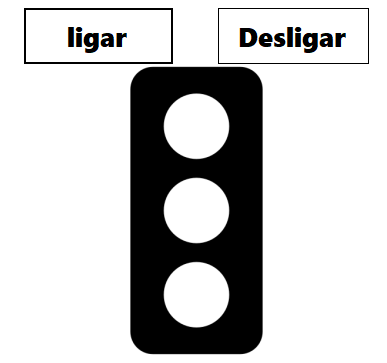

# Semáforo

este é um simples projeto de semáforo, que funciona mudando a imagem de 3 bolinhas coloridas(verde, amarelo e vermelho). A troca de cores é baseada em um semáforo padrão, e troca da seguinte maneira:

- inicia-se desligado
- ao clicar em "ligar", inicia o contador
- a cada 30 segundos, ele muda a cor
- primeira cor é vermelho, depois muda para verde, e por último amarelo
- continua em loop até o usuário desligar

## Screenshots

